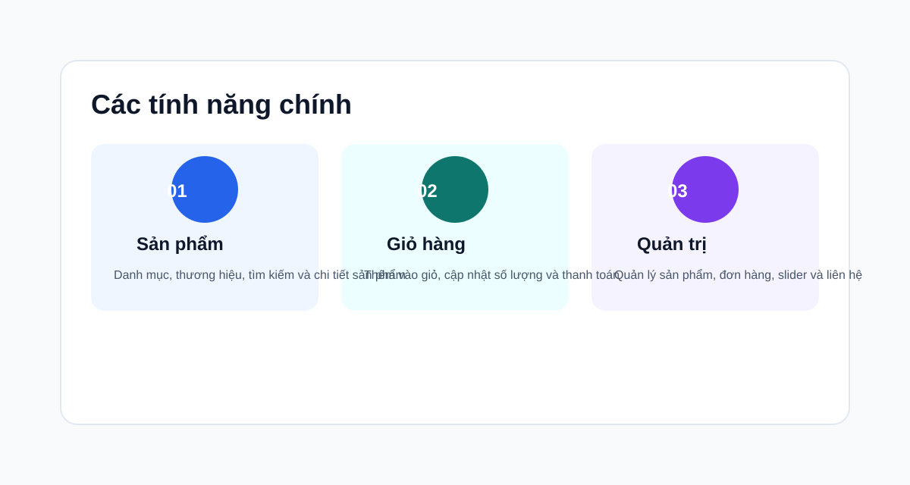
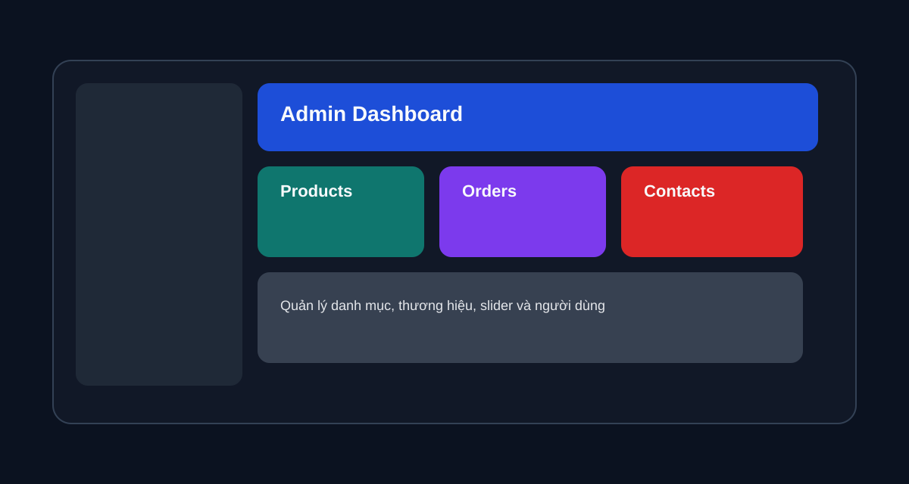

# Shopping Cart

Shopping Cart là một ứng dụng thương mại điện tử được xây dựng bằng ASP.NET Core MVC với .NET 9, sử dụng Entity Framework Core và SQL Server. Dự án hỗ trợ các chức năng cơ bản của một cửa hàng trực tuyến như xem sản phẩm, tìm kiếm, thêm vào giỏ hàng, thanh toán, wishlist, so sánh sản phẩm, đánh giá và quản trị nội dung.

## Tổng quan

Bạn có thể xem thêm các hình ảnh minh họa dưới đây để dễ hình dung giao diện của các trang chính trong hệ thống:

- Trang Home: giao diện trang chủ với sản phẩm nổi bật và các mục giới thiệu
- Trang Giỏ hàng: nơi người dùng xem sản phẩm đã chọn, cập nhật số lượng và tiến hành thanh toán
- Trang Danh mục: hiển thị sản phẩm theo từng nhóm danh mục
- Trang Thương hiệu: trình bày sản phẩm theo từng thương hiệu như Apple, Samsung
- Trang Admin sản phẩm: khu vực quản trị cho phép thêm, sửa và quản lý sản phẩm






## Tính năng chính

- Quản lý sản phẩm, danh mục và thương hiệu
- Tìm kiếm sản phẩm và xem chi tiết
- Giỏ hàng và quy trình thanh toán, bao gồm xem lại đơn hàng trước khi xác nhận
- Wishlist và so sánh sản phẩm
- Đánh giá sản phẩm và liên hệ
- Hệ thống đăng nhập, phân quyền và khu vực quản trị
- Seed dữ liệu ban đầu khi khởi động ứng dụng

## Công nghệ sử dụng

- ASP.NET Core MVC
- .NET 9
- Entity Framework Core
- SQL Server
- ASP.NET Core Identity
- Bootstrap và Razor View

## Cấu trúc dự án

- Controllers: xử lý request và điều hướng
- Models: các entity và view model
- Views: giao diện người dùng
- Areas/Admin: khu vực quản trị
- Repository: logic dữ liệu và seed dữ liệu
- wwwroot: tài nguyên tĩnh như hình ảnh, CSS, JavaScript

## Giao diện và trải nghiệm người dùng

- Trang Home: hiển thị sản phẩm nổi bật, slider và các mục giới thiệu chính
- Trang Giỏ hàng: cho phép người dùng xem sản phẩm đã chọn, cập nhật số lượng và tiến hành thanh toán
- Trang Danh mục: trình bày sản phẩm theo từng nhóm danh mục phù hợp với nhu cầu mua sắm
- Trang Thương hiệu: hiển thị sản phẩm theo từng thương hiệu như Apple, Samsung, và các nhãn hàng khác
- Trang Admin sản phẩm: quản trị viên có thể thêm, sửa, xóa và quản lý sản phẩm trong hệ thống
- Trang Admin khác: hỗ trợ quản lý danh mục, thương hiệu, slider, đơn hàng và liên hệ

## Yêu cầu hệ thống

- .NET SDK 9.0+
- SQL Server
- Visual Studio 2022 hoặc VS Code với C# extension

## Cách chạy dự án

1. Clone repository về máy
2. Cập nhật chuỗi kết nối trong file appsettings.json nếu cần
3. Mở terminal tại thư mục dự án và chạy:

```bash
dotnet restore
dotnet run
```

4. Mở trình duyệt tại địa chỉ:

```text
http://localhost:5000
```

> Khi chạy lần đầu, ứng dụng sẽ tự động thực hiện migration và tạo dữ liệu mẫu nếu cơ sở dữ liệu chưa có.
